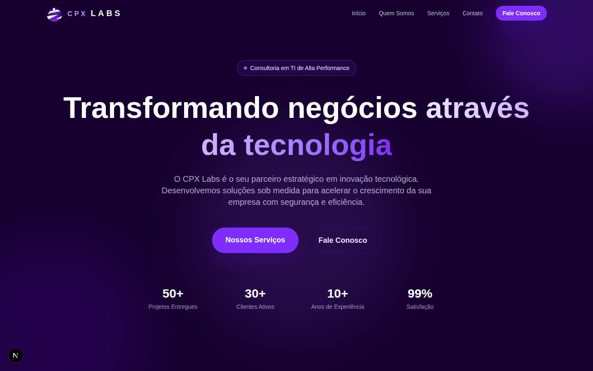
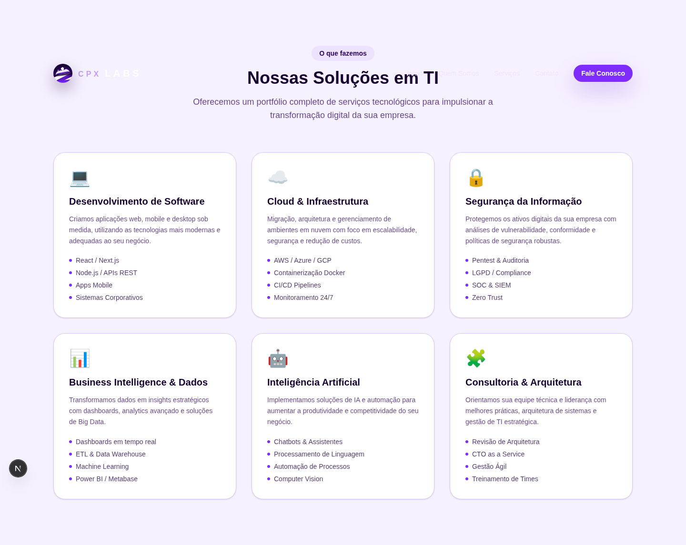
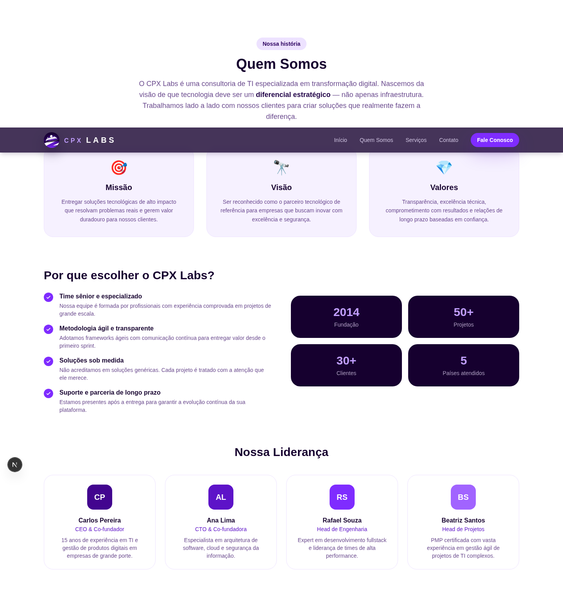
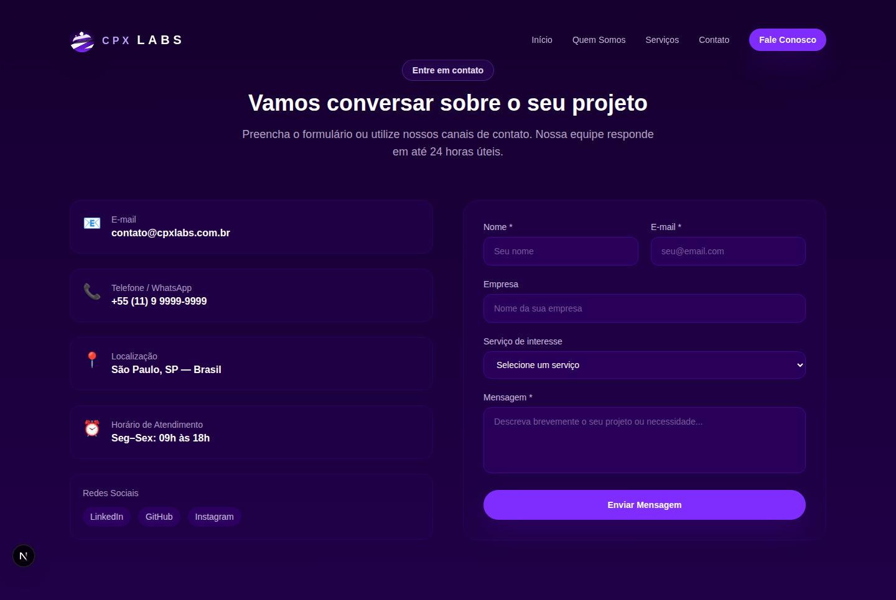

# CPX Labs — Site Institucional

Site institucional do **CPX Labs**, grupo de consultoria em TI, construído com **Next.js 16**, **TypeScript** e **Tailwind CSS 4**.

## Identidade visual

A interface segue a paleta oficial do logo do **CPX Labs**, baseada em tons profundos de roxo, violeta e branco.

| Token | Hex | Uso principal |
|---|---|---|
| `brand-950` | `#16002f` | fundos escuros e rodapé |
| `brand-900` | `#200047` | superfícies escuras secundárias |
| `brand-700` | `#42058f` | contraste e blocos institucionais |
| `brand-500` | `#7f2cff` | CTAs e destaques principais |
| `brand-300` | `#c29fff` | realces, hover e números |
| `brand-100` | `#ede2ff` | fundos suaves e badges claros |

Os tokens ficam centralizados em `/src/app/globals.css` e são reutilizados por todas as seções principais.

## Preview

### Início


### Serviços


### Quem Somos


### Contato


## Páginas e seções

| Seção | Descrição |
|---|---|
| **Início** | Hero com headline, estatísticas e CTAs |
| **Serviços** | 6 cards de serviços de TI (desenvolvimento, cloud, segurança, BI, IA e consultoria) |
| **Quem Somos** | Missão, visão, valores, diferenciais e equipe de liderança |
| **Contato** | Formulário funcional via `/api/contact` + canais de contato |

## Pré-requisitos

- **Node.js** ≥ 18
- **npm** ≥ 9

## Desenvolvimento local

```bash
# 1. Clone o repositório
git clone https://github.com/cpxlabs/cpx-labs.git
cd cpx-labs

# 2. Instale as dependências
npm install

# 3. Configure as variáveis de ambiente
cp .env.example .env.local
# Edite .env.local com seus valores

# 4. Inicie o servidor de desenvolvimento
npm run dev
# Acesse http://localhost:3000
```

## Scripts disponíveis

| Comando | Descrição |
|---|---|
| `npm run dev` | Inicia o servidor de desenvolvimento (Turbopack) |
| `npm run build` | Gera o build de produção |
| `npm run start` | Inicia o servidor de produção localmente |
| `npm run lint` | Executa o ESLint |
| `npm test` | Executa todos os testes |
| `npm run test:watch` | Executa os testes em modo watch |
| `npm run test:coverage` | Executa os testes com relatório de cobertura |

## Testes

O projeto usa **Jest** + **React Testing Library** para testes de componentes e de rota de API.

```bash
# Rodar todos os testes
npm test

# Modo watch (re-executa ao salvar)
npm run test:watch

# Com cobertura de código
npm run test:coverage
```

**Suítes de teste disponíveis (`src/__tests__/`):**

| Arquivo | O que testa |
|---|---|
| `Hero.test.tsx` | Headline, badge, CTAs, estatísticas |
| `Services.test.tsx` | 6 cards de serviços, destaques de tecnologias |
| `About.test.tsx` | Missão/visão/valores, time, diferenciais |
| `Contact.test.tsx` | Renderização do formulário, envio com sucesso, erros, payload |
| `Footer.test.tsx` | Links de navegação, redes sociais, copyright |
| `api.contact.test.ts` | Validação, sanitização e respostas do endpoint `/api/contact` |

## Estilo e branding

- A paleta global e o tratamento do logotipo ficam em `src/app/globals.css`.
- Os componentes em `src/components/` consomem os tokens `brand-*` para manter consistência visual.
- As screenshots em `public/screenshots/` foram atualizadas para refletir a identidade visual atual.

## Deploy na Vercel

### Deploy com um clique

[](https://vercel.com/new/clone?repository-url=https%3A%2F%2Fgithub.com%2Fcpxlabs%2Fcpx-labs)

### Deploy manual via CLI

```bash
# Instale a CLI da Vercel globalmente (se ainda não tiver)
npm i -g vercel

# Faça login na Vercel
vercel login

# Deploy de preview
vercel

# Deploy de produção
vercel --prod
```

### Variáveis de ambiente na Vercel

Configure as seguintes variáveis em **Vercel Dashboard → Project → Settings → Environment Variables**:

| Variável | Obrigatória | Descrição |
|---|---|---|
| `NEXT_PUBLIC_SITE_URL` | ✅ | URL pública do site (ex.: `https://cpxlabs.com.br`) |
| `CONTACT_TO_EMAIL` | ✅ | E-mail que recebe os contatos do formulário |
| `SMTP_HOST` | ⚠️ opcional | Host SMTP para envio de e-mails |
| `SMTP_PORT` | ⚠️ opcional | Porta SMTP (padrão: `587`) |
| `SMTP_USER` | ⚠️ opcional | Usuário SMTP |
| `SMTP_PASS` | ⚠️ opcional | Senha SMTP |

> **Sem SMTP configurado**: as submissões do formulário são registradas nos logs da Vercel Function. Integre o `nodemailer` (ou outro provider como [Resend](https://resend.com)) no arquivo `src/app/api/contact/route.ts` para habilitar o envio real de e-mails.

### Domínio customizado

Após o deploy, adicione seu domínio em **Vercel Dashboard → Project → Settings → Domains** e atualize a variável `NEXT_PUBLIC_SITE_URL`.

## Estrutura do projeto

```
cpx-labs/
├── src/
│   ├── __tests__/
│   │   ├── api.contact.test.ts   # Testes da route handler /api/contact
│   │   ├── About.test.tsx        # Testes do componente Quem Somos
│   │   ├── Contact.test.tsx      # Testes do formulário de contato
│   │   ├── Footer.test.tsx       # Testes do rodapé
│   │   ├── Hero.test.tsx         # Testes da seção de destaque
│   │   └── Services.test.tsx     # Testes da seção de serviços
│   ├── app/
│   │   ├── api/
│   │   │   └── contact/
│   │   │       └── route.ts      # Serverless function — formulário de contato
│   │   ├── globals.css
│   │   ├── layout.tsx            # Layout raiz (metadados SEO, lang="pt-BR")
│   │   └── page.tsx              # Página principal (single-page)
│   └── components/
│       ├── Header.tsx            # Navegação fixa e responsiva
│       ├── Hero.tsx              # Seção de destaque
│       ├── Services.tsx          # Grade de serviços
│       ├── About.tsx             # Quem somos + equipe
│       ├── Contact.tsx           # Formulário de contato
│       └── Footer.tsx            # Rodapé
├── public/
│   └── screenshots/              # Capturas de tela das seções
├── .env.example                  # Template de variáveis de ambiente
├── jest.config.ts                # Configuração do Jest
├── jest.setup.ts                 # Setup global dos testes (jest-dom)
├── vercel.json                   # Configuração do deploy na Vercel
└── next.config.ts                # Configuração do Next.js
```

## Tecnologias

- [Next.js 16](https://nextjs.org/) — framework React com App Router e Turbopack
- [React 19](https://react.dev/) — biblioteca de UI
- [Tailwind CSS 4](https://tailwindcss.com/) — estilização utilitária
- [TypeScript 5](https://www.typescriptlang.org/) — tipagem estática
- [Vercel](https://vercel.com/) — plataforma de deploy

---

© 2024 CPX Labs. Todos os direitos reservados.
